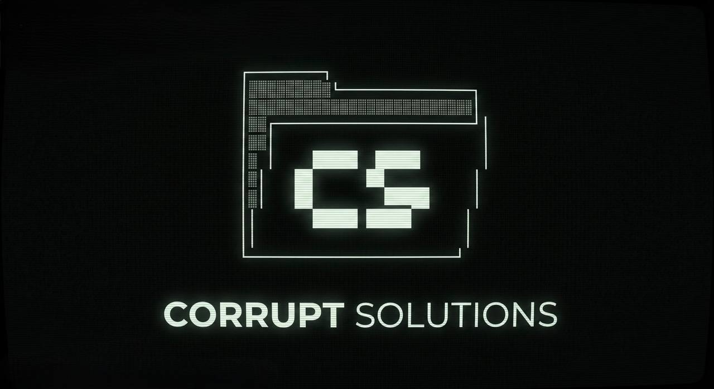

# 💠 CorruptCLI: The Autonomous SaaS Engine

**CorruptCLI** is a high-performance, "Business-in-a-Box" deployment suite designed for Corrupt Solutions. It provides a zero-cost, serverless architecture that can be stood up in minutes to manage booking, scheduling, and recurring revenue for any service-based business.

This repository is **Agent-Optimized**: It includes codified skills and CLI tools that allow AI agents (Vertex, Claude, etc.) to autonomously manage the entire deployment lifecycle—from rebranding to infrastructure provisioning.

---

## ⚡ Core Capabilities

### 1. 🏗️ Intellectual Scaffolding (`corrupt.py`)
The engine doesn't just copy files; it performs an intelligent rebranding.
- **Tenancy Modes**: Deploy in **Single-Tenant** (dedicated project) or **Multi-Tenant** (shared instance via `org_id`) modes.
- **Instant Theming**: Automatically injects client names, domains, admin emails, and primary brand colors across the entire frontend and backend.

### 2. 📡 Command Center (`super.html`)
The **Super Admin Portal** allows for global fleet management from a single interface.
- **Fleet Auditing**: View every organization, their MRR (Monthly Recurring Revenue), and active subscriber counts.
- **Tenant Impersonation**: One-click "Launch Dashboard" to jump into any client's admin or billing view.
- **Global Intelligence**: Aggregated revenue and activity streams across the entire multi-tenant network.

### 3. 📅 Premium Booking Engine
- **Real-Time Availability**: Dynamic calendar with 1 horizontal scrolling and instant capacity management.
- **Capacity Guardrails**: Prevents overbooking via native PostgreSQL triggers.

### 4. 💳 Subscription & Revenue Stack
- **Native Stripe Integration**: Handles recurring tiered memberships.
- **Billing Analytics Dashboard**: A specialized admin interface for tracking MRR, Churn, and customer transactions.

---

## 🏛️ Technical Stack
- **Frontend**: Vercel (Next.js/HTML5/Tailwind)
- **Database**: Supabase (PostgreSQL with Row Level Security)
- **Security**: Hardened RLS with JWT-injected Multi-Tenancy.
- **Automation**: Vercel Cron Jobs + Supabase Edge Functions.

---

## 🛠️ The Corrupt Toolkit

### `python3 corrupt.py`
The master initializer. Use this to spin up a new client site.

### `python3 validate.py`
The pre-flight auditor. Run this to verify API keys and connectivity.

### `engine/super.html`
The Super Admin Portal. Log in as `YOUR_SUPER_ADMIN_EMAIL` to manage the fleet.

---

**Built and Managed by Corrupt Solutions.** 💠
